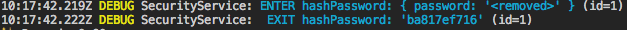

# defensive


`defensive` is a TypeScript library for creating contracts (aka services) with a proper validation and logging.  
It depends on [veni](https://github.com/BetterCallSky/veni) (validator) and [bunyan](https://github.com/trentm/node-bunyan) (logger)  


[](https://greenkeeper.io/)
[](https://travis-ci.org/BetterCallSky/defensive)
[](https://codecov.io/gh/BetterCallSky/defensive)
[](https://david-dm.org/BetterCallSky/defensive?type=dev)


### About
The motivation is to provide a library for [contract programming](https://en.wikipedia.org/wiki/Design_by_contract) that works well with TypeScript.  
There are many existing libraries for data validation that rely heavily on decorator annotations. Unfortunately, decorators have many flaws:
- it's an experimental feature, and its syntax is going to change,
- redundant syntax because we must create special classes instead of using plain objects,
- it's a runtime feature, and there are some [bugs related to reflection](https://github.com/kulshekhar/ts-jest/issues/439),
- no type inference, any typos or mistakes cause a runtime error instead of a compilation error.

 Since Typescript 2.8, it's possible to use [conditional types](https://github.com/Microsoft/TypeScript/pull/21496), that allow us to map one type to another. It's a powerful feature that can extract a Typescript interface from javascript objects (implemented by [veni](https://github.com/BetterCallSky/veni)).

 See the example below. There are no TypeScript annotations. It's pure JavaScript code, but we have type checking inferred from Veni.


### Features

- Full type inference for input parameters.
- Input validation and normalization (example: string type `"2"` to number type `2`).
- Input logging (input parameters):
```
myService: ENTER methodName: {param1: 'foo', param2: 'bar'}
```
- Output logging (sync and async):
```
myService:  EXIT methodName: {result: 'foobar', anotherProp: 'bar'}
```
- Error logging with input parameters (see example below).
- Bindings to 3rd party frameworks (see example below).

### Getting Started

```bash
npm install defensive
```
```bash
yarn add defensive
```

## Example usage 

```ts
// services/CalcService.ts
import { createContract } from 'defensive';
import { V } from 'veni';

export const add = createContract('CalcService#add')
  .options({ sync: true })
  .params('a', 'b')
  .schema({
    a: V.number(),
    b: V.number(),
  })
  .fn((a, b) => a + b);

add(1, 3); // returns 4
add('5' as any, '6' as any); // returns 11, input parameters are converted to number types
add('1' as any, { foo: 'bar' } as any); // logs and throws an error

```

use service
```ts
// app.ts
import { add } from './services/CalcService';


add(1, 3); // returns 4
add('5' as any, '6' as any); // returns 11, input parameters are converted to number types
add('1' as any, { foo: 'bar' } as any); // logs and throws an error
// NOTE: you shouldn't use casting `as any` in your code. It's used only for a demonstration purpose.
// The service is expected to be called with unknown input (for example: req.body).
```


See example under `examples/example1.ts`. Run it using `npm run example1`.


## Async example usage

file `services/UserService.ts`
```ts
import { createContract } from 'defensive';
import { V } from 'veni';

// UserService.ts

export const createUser = createContract('UserService#createUser')
  .params('values')
  .schema({
    values: V.object().keys({
      name: V.string().optional(),
      email: V.string().email(),
      password: V.string().min(5),
    }),
  })
  .fn(async values => {
    // do something with values
    // UserModel.create(values);
    const id = 1;
    return id;
  });
```
use service

```ts
// app.ts
import { createUser } from './services/UserService';

await createUser({
  name: 'john',
  email: 'john@example.com',
  password: 'secret',
}); // ok
await createUser({
  name: 'john',
  email: 'invalid email',
  password: 'secret',
}); // throws an error
```


See example under `examples/example2.ts`. Run it using `npm run example2`.  

## Removing security information
By default properties `password`, `token`, `accessToken` are removed from logging.  
Additionally you set options to `{removeOutput: true}` to remove the method result.  
Example:

file `services/SecurityService.ts`
```ts
// services/SecurityService.ts
import { createContract } from 'defensive';
import { V } from 'veni';
 
const hashPassword = createContract('SecurityService#hashPassword')
  .options({ sync: true })
  .params('password')
  .schema({
    password: V.string(),
  })
  .fn(password => 'ba817ef716');

hashPassword('secret-password');
```



See example under `examples/example3.ts`. Run it using `npm run example3`.


### Special properties
if the parameter name is `req` it's assumed that the object is an express request.  
Only properties are logged: `method`, `url`, `headers`, `remoteAddress`, `remotePort`.  


if the parameter name is `res` it's assumed that the object is an express response.  
Only properties are logged: `statusCode`, `header`.  

### Notes
- The wrapped function must have 0-4 arguments. 
- You can always override the inferred type. For example, if you to skip strict validation of properties.

```ts
createContract('CalcService#add')
  .options({ sync: true })
  .params('foo')
  .schema({
    foo: V.object(),
  })
  .fn((foo: SomeExistingObject) => {

  });

```

## Creating bindings
It's possible to extend the contract prototype and add custom metadata that can be used to mount the contract in 3rd party frameworks or library.  
For example: you can create your own binding for an express app, graphql app, kafka events or cron jobs.  

Example binding for Express  
```ts
import { createContract, ContractBinding } from 'defensive';
import { V } from 'veni';
import { Request, Response, default as express } from 'express';

// Creating binding definition
// bindings.ts

ContractBinding.prototype.express = function(options) {
  if (!this.fn.expressOptions) {
    this.fn.expressOptions = [];
  }
  this.fn.expressOptions.push(options);
  return this.fn as any;
};

interface ExpressOptions {
  auth?: boolean;
  method: 'get' | 'post' | 'put' | 'delete' | 'patch';
  path: string;
  handler(req: Request, res: Response): void;
}

declare module 'defensive' {
  interface ContractBinding<T> {
    expressOptions: ExpressOptions[];
    express(options: ExpressOptions): T & ContractBinding<T>;
  }
}

// Create service
// UserService.ts

export const getUser = createContract('User#getUser')
  .params('id')
  .schema({
    id: V.number(),
  })
  .fn(async id => {
    return {
      id,
      username: 'name',
    };
  })
  .express({
    auth: true,
    method: 'get',
    path: '/users/me',
    handler(req, res) {
      res.json(getUser(req.user.id));
    },
  })
  .express({
    method: 'get',
    path: '/users/:id',
    handler(req, res) {
      res.json(getUser(req.params.id));
    },
  });

// Main entry point
// app.ts

const app = express();

const authMiddleware = (req: Request, res: Response) => {
  // check if user is logged in
};

getUser.expressOptions.forEach(options => {
  const middleware = [options.handler];
  if (options.auth) {
    middleware.unshift(authMiddleware);
  }
  app[options.method](options.path, ...middleware);
});
```

## FAQ
1. Why can't I just use [express validator](https://express-validator.github.io/docs/) and write code directly in controllers?  

Such an approach can work for small apps, but it can complicate things if the application is growing. It's a common scenario when you write the code in one place, and then you must reuse it in another place.  
For example:  
You create an endpoint `/POST register` for user registration.  
After some time, you must create a command line script that will register a default user.  
You can't call the express router from the command line (you can try but it's a hacky solution), and you must either extract logic to common file (util or helper) or duplicate code. The application is much easier to understand if the business operations are organized in contracts/services instead of chaotic helper methods.

2. Why do you recommend to keep bindings and services in a single file?  
  
Most of the services are usually small, and there is 1:1 mapping between them and REST endpoints. It can be overwhelming for the developer when adding a new simple endpoint requires editing multiple files (controllers/services/route config).

3. Why bindings are not provided by this library?  
  
It's difficult to create a generic binding that will work well for all users. It's recommended to create a minimal binding that all only needed in your app.

### License
MIT